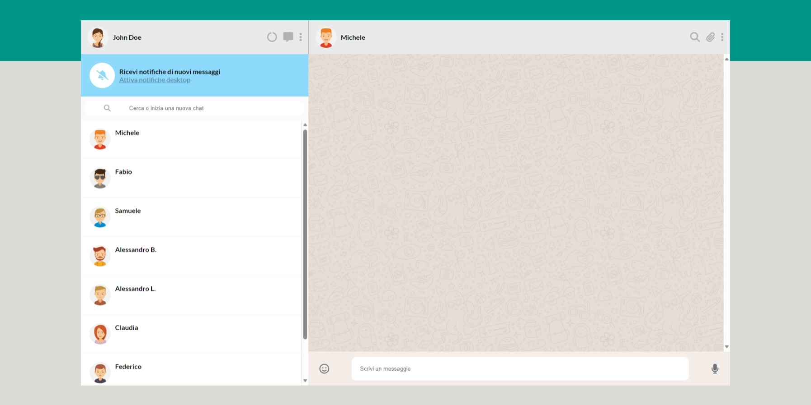

# Vue Boolzapp

Creazione di una web app ispirata a WhatsApp Web.

### Indice

-[ Creazione della struttura base](#milestone-1)

## Milestone 1

### Consegna

- Replica della grafica con la possibilità di avere messaggi scritti dall’utente (verdi) e dall’interlocutore (bianco) assegnando due classi CSS diverse

- Visualizzazione dinamica della lista contatti: tramite la direttiva v-for, visualizzare nome e immagine di ogni contatto

### Soluzione

Come da consegna ho ricreato la struttura base della web app e ho strutturato il codice in modo da facilitare l' inserimento di dati/eventi con Vue js.

Infatti ho incorporato la parte della chat (l' icona del contatto e la zona di visualizzazione messaggi) in un unico div, in modo da modificare il div padre e non i singoli elementi.

Inoltre ho deciso di non implementare Bootstrap perchè, dopo aver osservato il progetto, ho notato che molti dei componenti presenti e lo stile (colori/margini/padding...) non necessitavano di un framework così corposo per essere creati.
